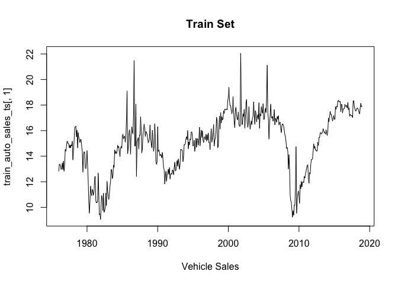

Vehicle Sales Forecasting
================
Yanet Gomez
12/14/2020

# 1\. DATA PROBLEM AND DESCRIPTION

## 1.1. Why is this topic important?

> The idea to explore car sales came from conversations about recent
> changes in the business models for some major automotive brands. With
> Ford, for example, it seems pretty obvious that a major change is
> taking place as the company is withdrawing their investments from in
> all of its traditional passenger cars, like the Fusion, Focus, and
> Taurus , and focusing almost exclusively in Trucks and SUVs (Chappell
> 2018). Being that the automotive industry is one of the most important
> economic sectors and has considerable impacts not only on revenue, but
> also in employment and environmental implications, it is very
> important to its many stakeholders and government officials to have
> reliable forecasting models. Auto sales , to include manufacturing of
> motor vehicles and parts, contributed about 2.6% to U.S. gross
> domestic product in 2019 (Economic Analysis (BEA) 2020). Auto and auto
> parts sales are the largest components of the total U.S. sales market,
> in 2020 auto and auto parts make up 10% of the total retail sales
> (Bureau 2020), but it has been even a larger percentage in past years.
> In 2018, the auto industry accounted for 20% of total sales, and on
> average, the industry employs 17.9 million people (Amadeo 2020).

## 1.2. Data and Problem Description

> The data for this project was collected from the Federal Reserve
> Economic Data site, and it covered from the year 1976 to 2020. The
> main objective of our project is to generate a highly accurate
> forecasting model for total vehicle sales in the U.S. market. To
> improve the accuracy, I included exogenous parameters that may not
> have been included in previously published models, such as Federal
> Funds Rate and Housing Starts. First, I fit a univariate ARIMA model,
> and then a multivariate ARIMA model, and compared forecast
> performance. The multivariate model performed much better.

## 1.3. Variables:

> The dataset includes 5 exogenous variables: Unemployment Rate
> Percent(Labor Statistics 2021), Gas Price Index(Labor Statistics(BLS)
> 2021a), Consumer Price Index(Labor Statistics(BLS) 2021b), Housing
> Starts(Bureau 2021), and Federal Funds Rate(Economic Co-operation and
> Development(OECD) 2021). The dependent variable is Car
> Sales\[(Economic Analysis 2021). The training set includes data from
> January 1976 to December 2018. The test set includes the period from
> January 2019 to September 2020.

## Data Collection-DATA 1 (1992–2008)

EXOGENOUS VARIABLES:

## 1.4. Methodology

> I compared between univariate(ARIMA) and a multivariate time series
> model (ARIMA), and evaluated the performance of the models to see
> which of the two types performs better at predicting car sales. The
> data was not normalized, and correlation analysis was performed to
> assess the relationship between the variable of interest and
> independent variables, as well as to identify collinearity among the
> independent variables. The dataset was divided into train and test
> set. The Test set was used in the multivariate prediction, and to
> assess the accuracy of the models. The univariate prediction was based
> solely on time.

## 1.5. Literature Review:

  - **General Sales Forecast Models for Automobile Markets and their
    Analysis (Hülsmann et al. 2012)**:
    
      - **Variables**: DAX, IFO, New Car Registrations, Gross Domestic
        Product, Personal Income, Rate in % of the total population,
        Interest Rate in %, Consumer Prices, Gasoline Prices, Private
        Consumption, Dow Jones, BCI
    
      - **Methods**: Time series analysis and classic data mining
        algorithms.
    
      - **Results**: Monthly forecasts were improved using absolute,
        normalized exogenous parameters. Decision trees were the most
        suitable method. The Support Vector Machine method did well due
        to its non-linearity. In contrast, linear methods like Ordinary
        Least Squares or Quantile Regression were not deemed not
        suitable.

  - **A Sales Forecast Model for the German Automobile Market Based on
    Time Series Analysis and Data Mining Methods.(Brühl et al. 2009)**:
    
      - **Variables**: GDP, Available Personal Income, Consumer Price
        Index, Unemployment Rate, Industrial Investment Demand, Petrol
        Charge, Price Consumption, Latent Replacement Demand, Model
        Policy
    
      - **Methods**: The time series model used consists of additive
        components: trend, seasonal, calendar and error component, these
        were estimated in a univariate manner while the trend component
        was estimated in a multivariate manner by Multiple Linear
        Regression as well as by a Support Vector Machine (yearly,
        monthly and quarterly). For the estimation of the seasonal
        component the Phase Average method was used. The data consisted
        of the main time series (registrations of new automobiles) and
        the secondary time series, exogenous parameters. Feature
        selection method Wrapper Approach with two different regression
        methods were used.
    
      - **Results**: This study found the non-linear model to be
        superior, and the quarterly data provided the most accurate
        results.

  - **Monthly Car Sales Prediction Using Internet Word-of-Mouth
    (eWOM)(<span class="citeproc-not-found" data-reference-id="INPROCEEDINGS">**???**</span>)**:
    
      - **Variables**: Economic indexes, text mining technology,
        Internet “word of mouth”, and Google Trends variables created by
        keyword searches in order to forecast the monthly sales volumes
        of various makes and models of cars.
    
      - **Methods**: Sentiment Score calculation, popular keyword search
        score calculation, data normalization, the models compared
        consisted of: Genetic Algorithm/K-Nearest Neighbor (GA/KNN),
        Support Vector Regression, Classification and Regression Trees,
        and Neural Network. The evaluation metric used was MAPE %.
    
      - **Results**: Among the four methods mentioned above, the GA/KNN
        model has the lowest predictive power in terms of Mean Absolute
        Percentage Error (MAPE), but GA/KNN can be used to create a
        successful forecasting model using only one month of data.

# 2\. RESULTS AND DISCUSSION

## Correlation Analysis among independent variables:

> The correlation matrix shows a strong positive correlation between Gas
> Price and Consumer Price Index (.9), and a strong negative correlation
> (-.8) between Consumer Price Index and Fed Funds.There is a moderate
> negative correlation (-.6) between Gas Prices and Housing Starts, and
> Gas Prices and Fed Funds. We still want to keep these variables in the
> model because based on our secondary research, we think they can still
> add information as to what drives car sales.

## Correlation Analysis between dependent and independent variables:

> There is a strong negative correlation(-.8) between car sales and
> unemployment. There is a week relationship between car sales and gas
> prices. There is a moderate correlation (-4,4) between car prices and
> Consumer Price, Housing Starts, and Fed Funds.

<!-- -->

## Time Series Plots

> From the first line plot for the training data we can see that car
> sales has a non-stationary trend. The trend seems to go up and down,
> but there doesn’t seem to be a seasonal pattern. The second plot for
> the test data shows a significant drop around March 2020, this is due
> to the COVID 19 shutdown. We do not expect the univariate
> autoregressive forecast to be able to reflect this. HOwever, I am
> interested in seeing how well the multivariate model performs in this
> regard.

> The plots showing the test set’s explanatory variables to be used in
> the multivariate model, show the impact of the shutdown, so I hope the
> forecast will be able to pick this
up.

### **Plotting Car Sales (Train Set)**


\#\#\# **Plotting Car Sales (Test
Set)**


\#\#\# **All Variables on the same
graph**

<!-- --><!-- -->

## ACF Plots for each variable to check for stationarity.

We can see from the Vehicle sales ACF plot that the data is not
stationary, since the data decreases slowly. The adf.test confirms **non
stationarity**.

<!-- -->

    ##      [,1] [,2] [,3] [,4] [,5] [,6] [,7] [,8]  [,9] [,10] [,11] [,12] [,13]
    ## ACF  0.91 0.87 0.86 0.85 0.84 0.82 0.81 0.79  0.78  0.75  0.73  0.72  0.69
    ## PACF 0.91 0.26 0.27 0.15 0.09 0.02 0.01 0.00 -0.01 -0.10  0.00  0.03 -0.10
    ##      [,14] [,15] [,16] [,17] [,18] [,19] [,20] [,21] [,22] [,23] [,24] [,25]
    ## ACF   0.67  0.65  0.62  0.60  0.58  0.56  0.54  0.50  0.48  0.45  0.42  0.40
    ## PACF -0.01 -0.05 -0.10 -0.03 -0.03  0.03 -0.03 -0.07 -0.01 -0.04 -0.07  0.05
    ##      [,26] [,27] [,28] [,29] [,30] [,31] [,32] [,33] [,34] [,35] [,36] [,37]
    ## ACF   0.38  0.36  0.34  0.32  0.29  0.27  0.25  0.22  0.20  0.18  0.15  0.13
    ## PACF -0.01  0.01  0.07  0.01 -0.04 -0.01 -0.05 -0.01 -0.05  0.01 -0.04 -0.02
    ##      [,38] [,39] [,40] [,41] [,42] [,43] [,44] [,45] [,46] [,47] [,48]
    ## ACF   0.11  0.09  0.08  0.06  0.04  0.02  0.01 -0.01 -0.02 -0.03 -0.04
    ## PACF -0.04  0.02  0.06 -0.01  0.01 -0.03  0.04  0.01 -0.01  0.03  0.02

    ## 
    ##  Augmented Dickey-Fuller Test
    ## 
    ## data:  TotalCarSales
    ## Dickey-Fuller = -2.1364, Lag order = 8, p-value = 0.5206
    ## alternative hypothesis: stationary

## Differencing to stationarize the data.

    ## [1] FALSE

    ## [1] TRUE

The Augmented Dickey-Fuller Test confirms the data is now
**stationary**.

    ## Warning in adf.test(diff_TotalCarSales): p-value smaller than printed p-value

    ## 
    ##  Augmented Dickey-Fuller Test
    ## 
    ## data:  diff_TotalCarSales
    ## Dickey-Fuller = -8.0331, Lag order = 8, p-value = 0.01
    ## alternative hypothesis: stationary

## Our first model is a univariate ARIMA. Starting with the autoARIMA function to extract parameters.

auto.arima() with stepwise = F, and approximation = F returned an
ARIMA(2,1,1)(2,0,0)\[12\], with AIC=1317.511. So, this is the AIC we are
trying to beat with the manual ARIMA model parameter selection.

## Manual ARIMA model Parameter Selection:

  - The process for manual parameter selection included evaluation of
    the ACF and PACF graphs as well as EACF. The decomposition shows
    some seasonal component, even though there is no seasonal pattern,
    but there is a varying trend, so a 2nd differencing step makes
    sense. We do not expect a constant in the model.
      - q = 2, the ACF shows negative significance at lag 1 and 2, so we
        can try at least 1 MA order
      - d = 1, given significant lags in PACF we can assume a second
        differencing step, non-constant trend
      - p = 1, PACF shows sharp cut off between significant and non
        significant lags, so at least 1 AR order
      - P = 1, because the correlation is negative at a significant lag,
        we can try one AR order
      - D = 0, there doesn’t seem to be a constant seasonal pattern.
      - Q = 1, Our data seems to have a non-constant seasonal effect.
        So,we could try 1 MA order.
  - From the evaluation of the ACF, PACF, EACF, we tried the following
    parameter options:
      - Model 3: p = 1, d = 1, q = 2, P = 1, D = 0, Q = 0
      - Model 4: p = 1, d = 1, q = 2, P = 0, D = 0, Q = 1
      - Model 5: p = 0, d = 2, q = 2, P = 0, D = 0, Q = 1
      - Model 6: p = 1, d = 2, q = 2, P = 1, D = 0, Q = 0
      - Model 7: p = 1, d = 1, q = 0, P = 1, D = 1, Q = 0
      - Model 8: p = 1, d = 2, q = 0, P = 0, D = 0, Q = 0
      - Model 9: p = 1, d = 2, q = 0, P = 0, D = 0, Q = 0
      - Model 10: p = 0, d = 2, q = 1, P = 0, D = 0, Q = 0
      - Model 11: p = 4, d = 1, q = 0, P = 0, D = 0, Q = 2
      - Model 12: p = 0, d = 1, q = 3, P = 1, D = 0, Q = 0
      - Model 13: p = 4, d = 2, q = 3, P = 0, D = 0, Q = 1
      - Model 14: p = 0, d = 2, q = 3, P = 1, D = 0, Q = 0
      - Model 15: p = 4, d = 2, q = 3, P = 0, D = 0, Q = 0
      - Model 16: p = 0, d = 2, q = 3, P = 0, D = 0, Q = 0
      - Model 17: p = 0, d = 1, q = 2, P = 0, D = 0, Q = 1
      - Model 18: p = 0, d = 2, q = 2, P = 0, D = 0, Q = 1
      - Model 19: p = 1, d = 2, q = 2, P = 0, D = 0, Q = 1
      - Model 20: p = 1, d = 2, q = 2, P = 0, D = 0, Q =
0


The list below shows the AIC values for each of the models generated:

    ##              AIC
    ## mod1:   1318.805
    ## mod2:   1317.511
    ## mod3:   1324.452
    ## mod4:   1322.787
    ## mod5:   1341.222
    ## mod6:   1335.419
    ## mod7:   1388.083
    ## mod8:   1750.782
    ## mod9:   1400.684
    ## mod10:  1446.899
    ## mod11:  1319.536
    ## mod12:  1323.120
    ## mod13:  1332.311
    ## mod14:  1335.371
    ## mod15:  1340.719
    ## mod16:  1338.402
    ## mod17:  1322.100
    ## mod18:  1341.222
    ## mod19:  1335.843
    ## mod20:  1743.063

## Best model

The best model is **Model 2** (mod20, ARIMA(2,1,1)(2,0,0)\[12\] based on
AIC (1317.511). The residuals look normal.

    ## Series: train_auto_sales_ts[, 1] 
    ## ARIMA(2,1,1)(2,0,0)[12] 
    ## 
    ## Coefficients:
    ##          ar1      ar2      ma1    sar1     sar2
    ##       0.0974  -0.1681  -0.5618  0.1380  -0.1075
    ## s.e.  0.0790   0.0545   0.0712  0.0441   0.0434
    ## 
    ## sigma^2 estimated as 0.7446:  log likelihood=-652.76
    ## AIC=1317.51   AICc=1317.68   BIC=1342.98

<!-- -->

    ## 
    ##  Ljung-Box test
    ## 
    ## data:  Residuals from ARIMA(2,1,1)(2,0,0)[12]
    ## Q* = 14.99, df = 19, p-value = 0.7232
    ## 
    ## Model df: 5.   Total lags used: 24

## Univariate ARIMA model fit and Forecast

### Model 2: ARIMA(2,1,1)(2,0,0)\[12\].

As we can see from the plot, showing the ‘train’ data, the actual values
and the forecasted values, the univariate model doesn’t seem to perform
very well. It does not capture the pattern in the data. It, definitely
does not account for the big drop in March 2020 due to COVID shutdown,
but this is to be expected. It doesn’t seem to capture the variation in
the data at all, it almost has a constant
trend.


## Multivariate Model Fit and Forecast

### Model: ARIMA(1,0,2)(0,0,2)\[12\]

We now fit a multivariate ARIMA model. As we can see from the graph, the
multivariate ARIMA model performed much better at forecasting car sales.
This model captured the drop in March 2020 due to COVID with accuracy,
this is because this pattern was reflected in the independent variables
used to build the model, as we saw at the beginning when we plot the
time series including all the variables in the test set (this is the
portion that includes this period). This confirms that the variable
selection, and the inclusion of multiple variables is appropriate for
predicting car sales.

    ## Series: TotalCarSales 
    ## Regression with ARIMA(1,0,2)(0,0,2)[12] errors 
    ## 
    ## Coefficients:
    ##          ar1      ma1      ma2    sma1     sma2  intercept  UnemplRate
    ##       0.9639  -0.5545  -0.1937  0.1213  -0.0993    16.6115     -0.7460
    ## s.e.  0.0153   0.0486   0.0454  0.0446   0.0433     1.6167      0.1053
    ##       GasPrices  ConsumPrices  HousingStarts  FedFunds
    ##          0.0022        0.0068         0.0017   -0.1088
    ## s.e.     0.0028        0.0063         0.0003    0.0448
    ## 
    ## sigma^2 estimated as 0.6816:  log likelihood=-628.39
    ## AIC=1280.78   AICc=1281.4   BIC=1331.74


## Forecast Accuracy Evaluation

I based the forecast evaluation on the Mean Absolute Percentage
Error(MAPE). The MAPE value for the univariate auto regressive model, is
14.72%. The MAPE value for the multivariate model is 7.41. The
multivariate ARIMA model performed much better at predicting car prices.
In addition, it was able to capture the drop in sales, caused by the
COVID shutdown in March 2000, by gathering information from the
exogenous variables included in the model that reflected the impact of
the shutdown.

``` r
univariate<-as.data.frame(accuracy(u_arimafor_values, Actual_Values))
univariate
```

    ##                 ME    RMSE      MAE       MPE     MAPE      ACF1 Theil's U
    ## Test set -1.820432 2.99199 1.820432 -14.72245 14.72245 0.7587082   2.00253

``` r
multivariate<-as.data.frame(accuracy(aa_frc_raw$mean, Actual_Values))
multivariate
```

    ##                  ME     RMSE      MAE       MPE    MAPE      ACF1 Theil's U
    ## Test set -0.5140206 1.607919 1.078192 -3.458386 7.41085 0.3533489 0.8214723

# 3\. CONCLUSION

> The multivariate ARIMA model performed much better at predicting car
> prices. In addition, it was able to capture the drop in sales, caused
> by the COVID shutdown in March 2000, by gathering information from the
> exogenous variables included in the model that reflected the impact of
> the shutdown. For future work, it will be interesting to include
> Neural Net and VAR models to compare their performance.

# 4\. REFERENCES

<div id="refs" class="references">

<div id="ref-Amadeo">

Amadeo, K. 2020. “The Economic Impact of the Automotive Industry,
September 30, 2019.”
<https://www.thebalance.com/economic-impact-of-automotive-industry-4771831>.

</div>

<div id="ref-bruhl2009sales">

Brühl, Bernhard, Marco Hülsmann, Detlef Borscheid, Christoph M
Friedrich, and Dirk Reith. 2009. “A Sales Forecast Model for the German
Automobile Market Based on Time Series Analysis and Data Mining
Methods.” Springer.

</div>

<div id="ref-Retail">

Bureau, U.S. Census. 2020. “U.S. Census Bureau, Advance Monthly Retail
Trade Survey, November 17, 2020.”
<https://www.bea.gov/data/gdp/gdp-industry>.

</div>

<div id="ref-HOUST">

———. 2021. “Housing Starts.” <https://fred.stlouisfed.org/series/HOUST>.

</div>

<div id="ref-Chappell">

Chappell, B. 2018. “Ford to Phase Out ’Traditional Ford Sedans’ Such as
Fusion and Taurus in the U.s.”
<https://www.npr.org/sections/thetwo-way/2018/04/26/605971051/ford-to-phase-out-traditional-ford-sedans-such-as-fusion-and-taurus-in-the-u-s.>

</div>

<div id="ref-GDP">

Economic Analysis (BEA), U.S. Bureau of. 2020. “GDP by Industry, Value
Added by Industry, Value Added by Industry (a) (Q) " Annual Industry
Data.” <https://www.bea.gov/data/gdp/gdp-industry>.

</div>

<div id="ref-TOTALSA">

Economic Analysis, U.S. Bureau of. 2021. “Total Vehicle Sales.”
<https://fred.stlouisfed.org/series/TOTALSA>.

</div>

<div id="ref-USALOCOSINOSTSAM">

Economic Co-operation, Organization for, and Development(OECD). 2021.
“Leading Indicators Oecd: Component Series: Interest Rate Spread:
Normalised for the United States (Usalocosinostsam).”
[https://fred.stlouisfed.org/series/USALOCOSINOSTSAM](%20https://fred.stlouisfed.org/series/USALOCOSINOSTSAM).

</div>

<div id="ref-hulsmann2012general">

Hülsmann, Marco, Detlef Borscheid, Christoph M Friedrich, and Dirk
Reith. 2012. “General Sales Forecast Models for Automobile Markets and
Their Analysis.” *Trans. MLDM* 5 (2): 65–86.

</div>

<div id="ref-CUSR0000SETB01">

Labor Statistics(BLS), U.S. Bureau of. 2021a. “Consumer Price Index for
All Urban Consumers: Gasoline (All Types) in U.s. City Average
(Cusr0000setb01).” <https://fred.stlouisfed.org/series/CUSR0000SETB01>.

</div>

<div id="ref-CUUR0000SA0R">

———. 2021b. “Consumer Price Index for All Urban Consumers: Purchasing
Power of the Consumer Dollar in U.s. City Average (Cuur0000sa0r).”
[https://fred.stlouisfed.org/series/CUUR0000SA0R](%20https://fred.stlouisfed.org/series/CUUR0000SA0R).

</div>

<div id="ref-UNRATE">

Labor Statistics, U.S. Bureau of. 2021. “Unemployment Rate (Unrate).”
<https://fred.stlouisfed.org/series/UNRATE>.

</div>

</div>
